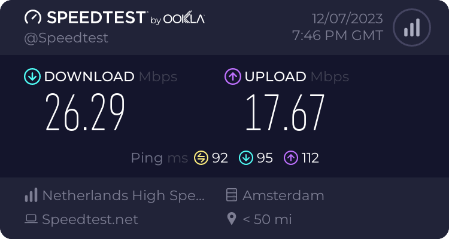
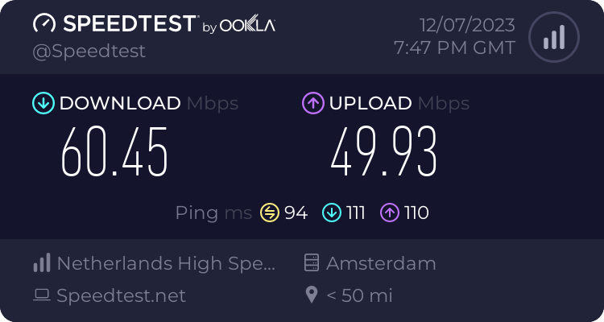

<p align="center">

<h1 align="center">Tapir</h1>
<h4 align="center">VPN server & client</h4>
</p>

## Build and install server

```
git clone https://github.com/forest33/tapir
cd tapir
docker-compose build
docker-compose run --rm tapir-server init -host SERVER_HOSTNAME_OR_IP
docker-compose up -d
```

## Creating a user and retrieve the client configuration

```
docker-compose run --rm tapir-server create -name USERNAME -password PASSWORD
docker-compose run --rm tapir-server export -name USERNAME > profile.tapir
```

## Speed test results

### OpenVPN


### Tapir


## Packet format

```
| T | F |      PSN      |      SID     |   L   |
|---|---|---------------|--------------|-------|
|                                              |
|                   Payload                    |
|                                              |

T - packet type, 8 bits
F - flags, 8 bits
PSN - packet serial number, 32 bits
SID - session idenificator, 32 bits
L - payload length, 16 bits
```

### Packet types
- 0x01 - authentication
- 0x02 - handshake
- 0x03 - data
- 0x04 - keepalive
- 0x05 - reset

### Flags
- 0x00 - normal packet
- 0x01 - error
- 0x02 - request
- 0x04 - acknowledgement
- 0x08 - LZ4 compression
- 0x10 - LZO compression
- 0x20 - ZSTD compression

### Authentication request
```
|L|      N       |L|      P       | 
|-|--------------|-|--------------|

L - field length
N - user name
P - password
```

### Authentication response
```
| S |L|      LA      |L|      RA      | 
|---|-|--------------|-|--------------|

S - session idenificator, 32 bits
L - field length
LA - local IP address
RA - remote IP address
```

### Handshake request/response
```
|L|      K       |         
|-|--------------|

L - field length
K - public key
```